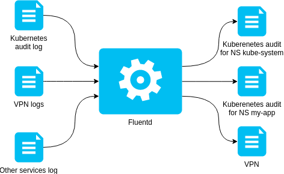


* <https://docs.kublr.com/articles/kubernetes-log-audit/>
* <https://mherman.org/blog/logging-in-kubernetes-with-elasticsearch-Kibana-fluentd/>
* <https://kubernetes.io/docs/tasks/debug-application-cluster/audit/#log-collector-examples>


> **Note :** Even if this part is not **required**, you **should** not ignore it on dev environment and **should** really *really* **REALLY** not skip it for production. In fact, it can contain useful debug informations and security traces to see what is going on in your kubernetes cluster, and even on your whole server(s).

This tutorial will guide you to setup audit log policy, catch logs with Fluentd, cast them to elasticsearch & show them using Kibana.

In order to pipe audit log messages to Elasticsearch, we need to install fluentd on the kubernetes master host.



## Install fluentd (on the kubernetes master host)

<https://docs.fluentd.org/installation/before-install>

### Install Chrony

<https://www.tecmint.com/install-ntp-in-rhel-8/>

Start by installing Chrony for accurate timestamps

```sh
dnf install chrony
systemctl enable --now chronyd
```

You should be good to go.

### Configure other settings

Check the file descriptors limit

```sh
ulimit -n
```

If it is low (like 1024), you need to increase it

```sh
vim /etc/security/limits.conf
```

Set the following configurations:

```
root soft nofile 65536
root hard nofile 65536
* soft nofile 65536
* hard nofile 65536
```

Then reboot & recheck.

```sh
ulimit -n # should be 65536
```

If the environment is expected to have a high load, follow [this section of the guide](https://docs.fluentd.org/installation/before-install#optimize-network-kernel-parameters)


### Install FluentD & plugins

<https://docs.fluentd.org/installation/install-by-rpm>

Add the `td-agent` repository & install it

```sh
curl -L https://toolbelt.treasuredata.com/sh/install-redhat-td-agent3.sh | sh
systemctl enable --now td-agent.service
```

Check if it works by posting a sample log

```sh
curl -X POST -d 'json={"json":"message"}' http://localhost:8888/debug.test
cat /var/log/td-agent/td-agent.log # should end with our test message above
```

Install required plugins with the following command:

```sh
td-agent-gem install fluent-plugin-forest fluent-plugin-rewrite-tag-filter
```

If having errors here, see the Troubleshoot section at the end.

### Configure Fluentd


* <https://kubernetes.io/docs/tasks/debug-application-cluster/audit/#log-collector-examples>


Choose an audit log dir name on the host :bookmark: `{{audit.logDir}}`. It **should** be in `/var/log`. Then, choose an audit log file :bookmark: `{{audit.logFile}}` in :bookmark: `{{audit.logDir}}`

<https://kubernetes.io/docs/tasks/debug-application-cluster/audit/#log-collector-examples>

Install the [:clipboard: td-agent/kube.conf](./td-agent/kube.conf) template template into `/etc/td-agent/`, include it in your master configuration, and create the log dirs.



```sh
mv ./td-agent/kube.conf /etc/td-agent/td-agent.conf
# Include kubernetes configuration it in configuration
echo "@include './kube.conf'" >> /etc/td-agent/td-agent.conf
# Create the log dir that will be mounted into the API server
mkdir -p {{audit.destLogDir}}
# If required, allow td-agent to read/write in it
chown -R root:td-agent {{audit.destLogDir}}
chmod -R g+w {{audit.destLogDir}}
# Restart the agent
systemctl restart td-agent.service
```

## Setup the audit log

<https://kubernetes.io/docs/tasks/debug-application-cluster/audit/#audit-policy>
<https://medium.com/@noqcks/kubernetes-audit-logging-introduction-464a34a53f6c>

See the [example audit log policy](https://raw.githubusercontent.com/kubernetes/website/master/content/en/examples/audit/audit-policy.yaml) & the [template audit log file](./kubernetes/audit-log-policy.yaml).



Move it in the `/etc/kubernetes` folder (because this is a kubernete's configuration).

```sh
mv ./kubernetes/audit-log-policy.yaml /etc/kubernetes/audit-log-policy.yaml
```

The path of the audit log policy file will later be referenced as the **variable** `{{audit.policyFile}}`.

## Troubleshoot

### `Unable to download data from https://rubygems.org/ - timed out (https://api.rubygems.org/specs.4.8.gz)`

Rubygems repository seems to have issues with IPv6. Check with below commands:

```sh
curl -v --head https://api.rubygems.org
curl -6 -v --head https://api.rubygems.org
```

If the 1st command worked and the second hang (timeout), then you are having troubles with IPv6, and you need to temporarly disable it.

```sh
sysctl -w net.ipv6.conf.default.disable_ipv6=1
sysctl -w net.ipv6.conf.all.disable_ipv6=1
```

After installing your plugin, re-enable IPv6

```sh
sysctl -w net.ipv6.conf.default.disable_ipv6=0
sysctl -w net.ipv6.conf.all.disable_ipv6=0
```