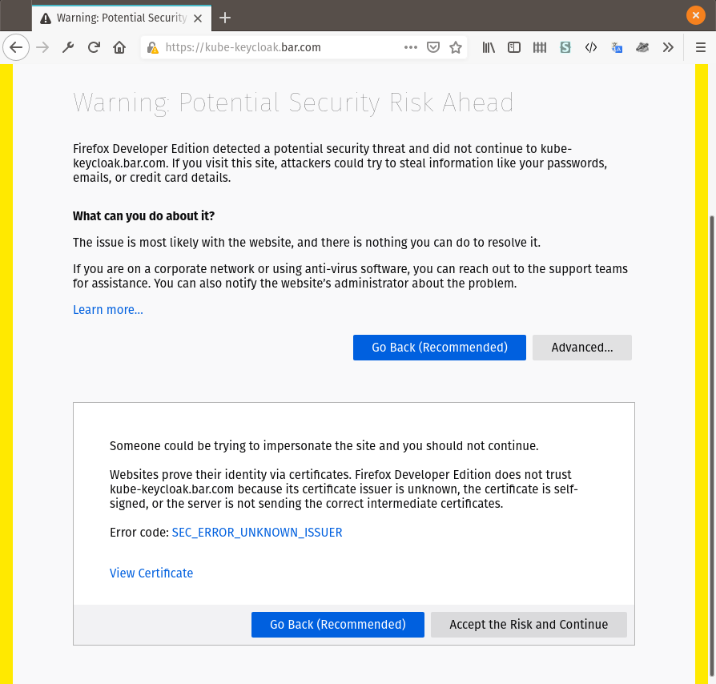
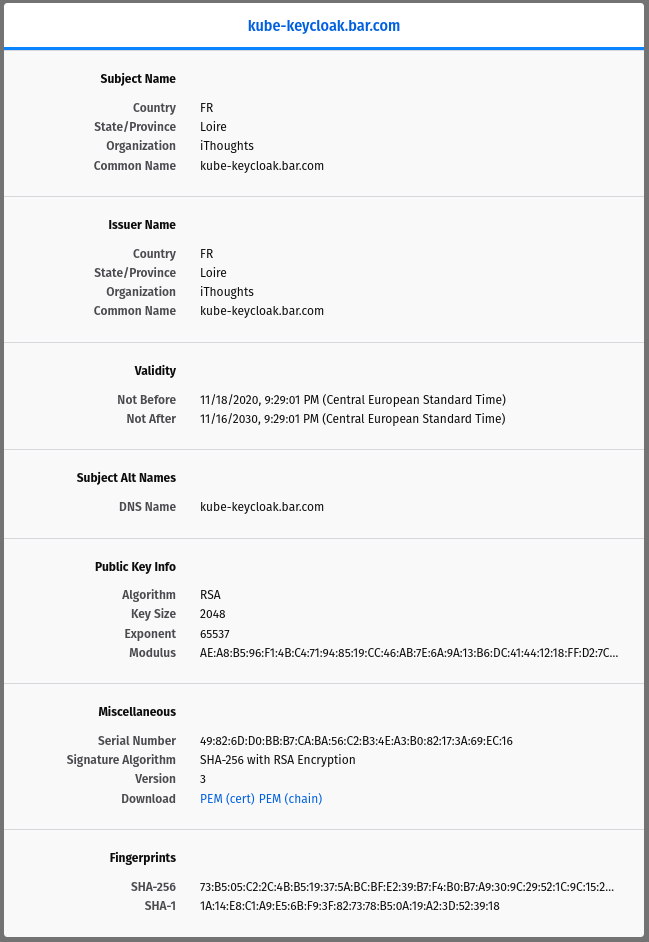

## Create the realm and the client


* <https://github.com/zufardhiyaulhaq/engineering-notes/blob/master/notes/kubernetes-keycloak-integration.md>


```sh
REALM_URL="https://keycloak.{{cluster.baseHostName}}/auth/realms/{{apiServer.realmName}}"
# Log in
TOKEN_RESPONSE="$(curl \                           
        -d "grant_type=password" \                                
        -d "client_id={{apiServer.clientId}}" \
        -d "client_secret={{apiServer.clientSecret}}" \
        -d "username=admin-user" \
        -d "password=admin-user" \
        $REALM_URL/protocol/openid-connect/token)"
# Extract the access token
ACCESS_TOKEN="$(echo "$TOKEN_RESPONSE" | jq '.access_token' -r)"
# Check token
curl \
        --user "{{apiServer.clientId}}:{{apiServer.clientSecret}}" \
        -d "token=$ACCESS_TOKEN" \
        $REALM_URL/protocol/openid-connect/token/introspect -k
```

## Set up certificates


* <https://medium.com/@zufardhiyaulhaq/kubernetes-authentication-with-keycloak-openid-connect-part-1-14f4e778b5e9#5252>


### Generate the certificates


* <https://en.wikipedia.org/wiki/List_of_ISO_3166_country_codes>
* <https://security.stackexchange.com/a/159537>


```sh
mkdir certs
cd certs
# CA part (Certificate Authority)
# Generate the CA (Certificate Authority) private key
openssl genrsa -out ca.key 2048
# Generate the CA (Certificate Authority) certificate
openssl req -new -x509 \
        -subj "/C={{countryCodeIso3166_1_alpha_2}}/ST={{State}}/O={{companyName}}/CN={{cluster.baseHostName}}" \
        -addext "subjectAltName = DNS:{{cluster.baseHostName}}" \
        -key ca.key -out ca.crt
# # Import the CA (Certificate Authority) in the truststore, so that certificates signed by our authority are considered as trusted
# keytool -import -file ca.crt -keystore ca.truststore -keypass PASSWORD -storepass PASSWORD

# Keycloak part
# Generate the keycloak's private key
openssl genrsa -out keycloak.key 2048
# Generate the keycloak's CSR (Certificate Signing Request)
openssl req -new \
        -subj "/C={{countryCodeIso3166_1_alpha_2}}/ST={{State}}/O={{companyName}}/CN=kube-keycloak.{{cluster.baseHostName}}" \
        -addext "subjectAltName = DNS:kube-keycloak.{{cluster.baseHostName}}" \
        -key keycloak.key -out keycloak.csr
# Sign the CSR using our custom CA
openssl x509 -req \
        -days 3650 \
        -extfile <(printf "subjectAltName=DNS:kube-keycloak.{{cluster.baseHostName}}") \
        -CA ca.crt -CAkey ca.key \
        -in keycloak.csr -out keycloak.crt
```

Finally, inspect your keycloak's certificate.

```sh
openssl x509 -noout -text -in keycloak.crt
```

If all worked well, the output should be like this:

```
Certificate:                                                     
    Data:                                                        
        Version: 3 (0x2)                                         
        Serial Number:                                           
            # ...
        Signature Algorithm: sha256WithRSAEncryption             
        Issuer: C = {{countryCodeIso3166_1_alpha_2}}, ST = {{State}}, O = {{companyName}}, CN = {{cluster.baseHostName}}
        Validity
            Not Before: Nov 18 20:29:01 2020 GMT
            Not After : Nov 16 20:29:01 2030 GMT
        Subject: C = {{countryCodeIso3166_1_alpha_2}}, ST = {{State}}, O = {{companyName}}, CN = kube-keycloak.{{cluster.baseHostName}}
        Subject Public Key Info:
            Public Key Algorithm: rsaEncryption
                RSA Public-Key: (2048 bit)
                Modulus:
                    # ...
                Exponent: # ...
        X509v3 extensions:
            X509v3 Subject Alternative Name:
                DNS:kube-keycloak.{{cluster.baseHostName}}
    Signature Algorithm: sha256WithRSAEncryption
         # ...
```


The important part is that your certificate contains the correct `X509v3 Subject Alternative Name` field. If it is missing, Go will complain to you that the certificate use obsolete Common Name.

Go deprecated use of Common Name by default since v1.15 via [this commit](https://github.com/golang/go/commit/d65e1b2e41deb810565c94555d791e7384618da0).

<!-- # Finally, generate the public key for keycloak
openssl pkcs12 -export -in keycloak.crt -inkey keycloak.key -out keycloak.p12 -name myserverkeystore -CAfile ca.crt
-->

### Pass certificates to keycloak

The [keycloak docker container](https://hub.docker.com/r/jboss/keycloak/) indicates that keycloak will use certificate and private keys from `/etc/x509/https/tls.{crt,key}`. So, we are going to pass those via a secret mounted at the desired directory.

First, create the secret

```sh
# Create our secret that will be mounted into our pod
kubectl create secret generic certs -n keycloak --from-file keycloak.crt --from-file keycloak.key
```

Then, update your *keycloak* chart values to mount this new secret.



Finally, update your chart.

```sh
# Update our release to use the certificates
helm upgrade -n keycloak -f ./kubernetes/authentication/01-KeycloakChartValues.yaml keycloak codecentric/keycloak
```

## Enable alternative routing to *keycloak*



```sh
# Add a new route from "kube-keycloak.{{cluster.baseHostName}}" that delegates to the TLS connection using the certs declared above
kubectl apply -f ./kubernetes/authentication/03-InternalRoute.yaml
```

Go to `https://kube-keycloak.{{cluster.baseHostName}}`. It should show you a security erro `SEC_ERROR_UNKNOWN_ISSUER`.



Don't worry, this is normal since *keycloak*'s certificate was signed by our custom Certificate Authority (CA). For curiosity, click on `View Certificate`.



The certificate correctly shows the `Subject Alt Names` extension, and is signed by our custom CA.

A last verification step: ensure that requests are correctly trusted if using our custom CA.

```sh
curl --cacert ca.crt https://kube-keycloak.{{cluster.baseHostName}}/ &&
    echo 'Yay! Certificates correctly installed' ||
    echo 'Erf, something isn\'t right'
```

If the command above works, our certificates are valid !

## Enable OIDC in the API server


* <https://stackoverflow.com/questions/50007654/how-does-kube-apiserver-restart-after-editing-etc-kubernetes-manifests-kube-api>


Place CA files in a safe place where kubernetes will be able to get it to check keycloak's certificate.

```sh
# Move and changes rights
mkdir /etc/kubernetes/auth-cert
chmod 755 /etc/kubernetes/auth-cert
mv ./* /etc/kubernetes/auth-cert
chmod 644 /etc/kubernetes/auth-cert/*
chmod 600 /etc/kubernetes/auth-cert/*.key
chown -R root:root /etc/kubernetes/auth-cert
# Remove the dir
cd ../
rm -r certs
```>

Then

```sh
vim /etc/kubernetes/manifests/kube-apiserver.yaml
```

Patch it to add following fields

```yaml
#...
spec:
    containers:
    - command:
        - kube-apiserver
        # ...
        - --oidc-issuer-url=https://kube-keycloak.{{cluster.baseHostName}}/auth/realms/{{apiServer.realmName}}
        - --oidc-client-id={{apiServer.clientId}}
        - --oidc-groups-claim=user_groups
        - --oidc-username-claim=preferred_username
        - "--oidc-groups-prefix=oidc:"
        - "--oidc-username-prefix=oidc:"
        - --oidc-ca-file=/etc/kubernetes/auth-cert/ca.crt
        volumeMounts:
        # ...
        - mountPath: /etc/kubernetes/auth-cert
            name: etc-kubernetes-auth-cert
            readOnly: true
        # ...
    volumes:
    # ...
    - hostPath:
            path: /etc/kubernetes/auth-cert
            type: DirectoryOrCreate
        name: etc-kubernetes-auth-cert
    # ...
```


The API server should restart automatically, because it is watching this manifest file.

If it does not, (or you want to restart it anyway because you changed the certificates), run:

```sh
kubectl -n kube-system delete pod kube-apiserver-{{cluster.masterNode.1}}
```


Then, create the `ClusterRoleBinding`s for the test groups:

```sh
kubectl apply -f authentication/03-ClusterRoleBindings.yaml
```

Use *kubelogin*: https://github.com/int128/kubelogin

```sh
kubectl krew install oidc-login
```

Then, configure it:

```sh
kubectl oidc-login setup \
    --oidc-issuer-url=https://kube-keycloak.{{cluster.baseHostName}}/auth/realms/{{apiServer.realmName}} \
    --oidc-client-id={{apiServer.clientId}} \
    --oidc-client-secret={{apiServer.clientSecret}} \
    --certificate-authority=/etc/kubernetes/auth-cert/ca.crt
    # Add the parameter below if running from an environment where browser is unavailable. Don't forget to add ` \` above
    # --grant-type=authcode-keyboard
```

The command above will output you installation instruction. Don't pay attention to the `## 3.` *cluster role* setup part, we are getting to it, in a more generic way.
And we already did the `## 4.` API server setup above. Just run the step `## 5.` to set credentials for our `oidc` user.

Finally, create a new context for your user (and optionally switch to this context)

```sh
# Create the context
kubectl config set-context oidc@{{cluster.name}} --cluster="{{cluster.name}}" --user="oidc"
# Switch to the context
kubectl config use-context oidc@{{cluster.name}}
# Go back to the admin context
kubectl config use-context kubernetes-admin@{{cluster.name}}
```


```sh
# Get the current context
kubectl config current-context
# List contexts
kubectl config get-contexts
# Switch to other context
kubectl config use-context {{contextName}}
```



<!-- Create a test user, so that you can try your new contexts

```sh
useradd test
su test
``` -->

## Usefull commands

```sh
kubectl -n keycloak get secret certs -o json | jq '.data["keycloak.crt"]' -r | base64 --decode | openssl x509 -noout -text
```


