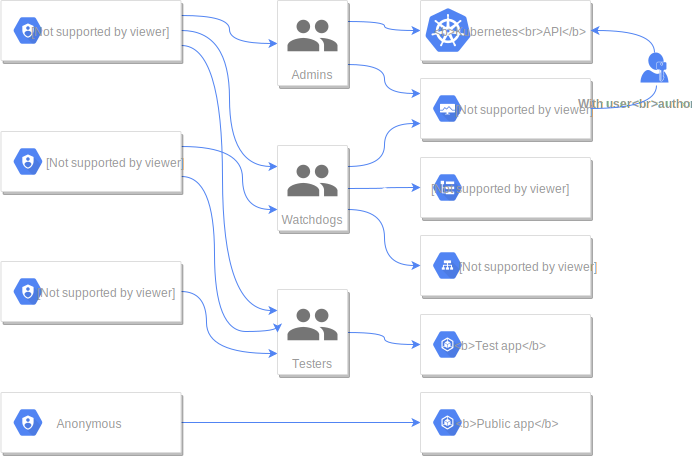

Now that we have our authentication service up and running, we can protect our dashboards installed in the step [06 - Monitoring: See what is going on](../06-monitoring) using our *Keycloak* OpenID Connect provider. Here is a diagram on how authorization will be managed:

## Traefik dashboard

## Kibana

## Kube dashboard


* https://itnext.io/protect-kubernetes-dashboard-with-openid-connect-104b9e75e39c


Again, we are going to set up a new instance of [*louketo-proxy*](https://github.com/louketo/louketo-proxy).



Finally, modify your ingress route




